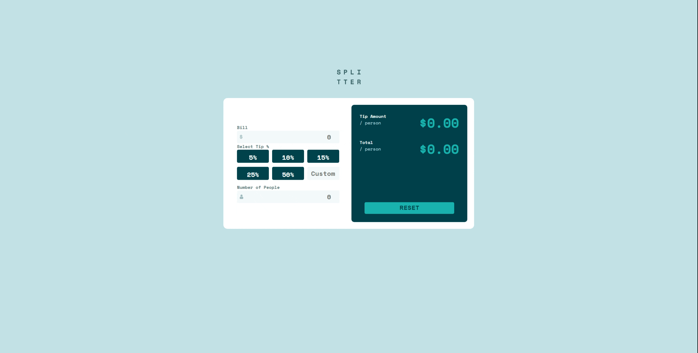
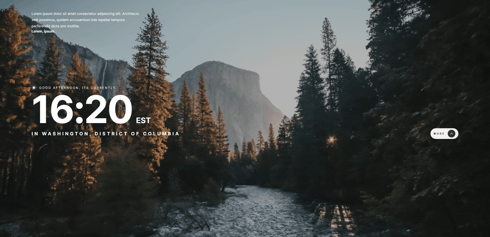
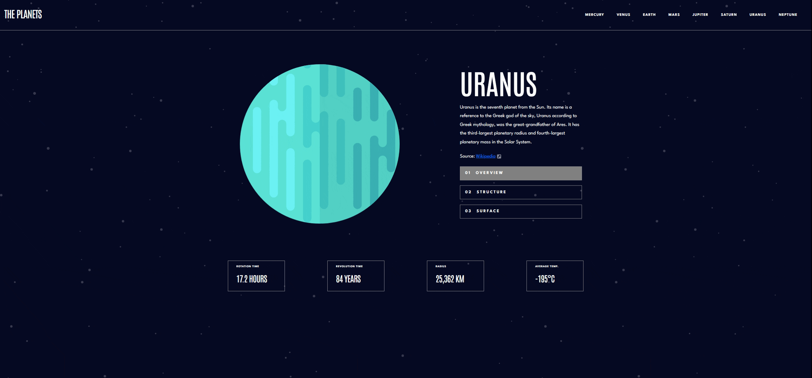
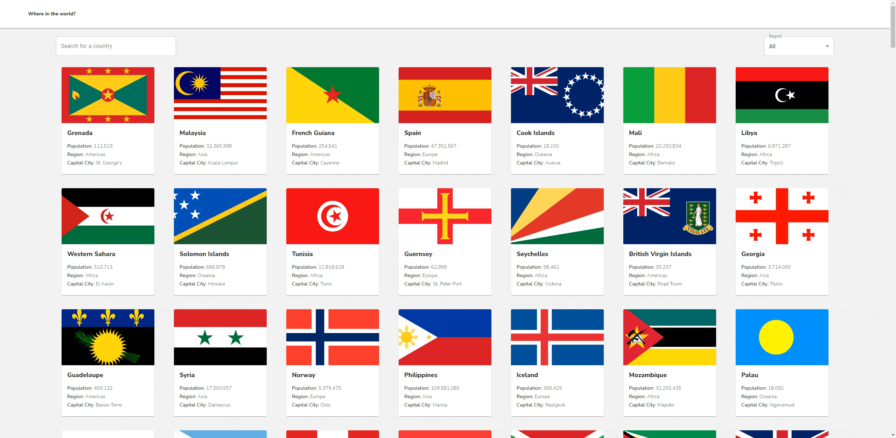

  
  
  
  
  

I'm Software developer with experience in full-stack web development and game development using the unity engine looking to gain
valuable professional work experience while developing skills as a programmer.

See [my website](https://ejmilord.netlify.app/) for more information!

<h1 align="center">Projects</h1>
<table bordercolor="#66b2b2">
 <!-- Row 1 Start -->
  <tr>
    <td width="50%" valign="top">
      <h3 align="center">Splitter Calculator</h3>
         
      
         
        
   
  
  
      

        
<strong>HTML | BOOTSTRAP 5 | JAVASCRIPT</strong> - A tool to help you splitter the bill when you go out to eat with friends! Also useful if you eat out solo.

    </td>
    <td width="50%" valign="top">
      <h3 align="center">Clock App</h3>
         
        
         
        

          
  
  
      

        
<strong>HTML | CSS | JAVASCRIPT | REST APIS</strong> -A simple app that displays the time in your location, as well as a random quote. 

    </td>

    
  </tr>
  <!-- Row 1 End -->

  <!-- Row 2 Start -->
   
  <tr>
    <td width="50%" valign="top">
      <h3 align="center">The Planets</h3>
         
      
         
        
   
  
  
      

        
<strong>NODE.JS | EJS </strong> - Created a simple Node server that takes data from a JSON file and displays it onto the screen using an EJS template

    </td>
    <td width="50%" valign="top">
      <h3 align="center">Where in the world?</h3>
         
        
         
        

          
  
  
      

        
<strong>REACT | MATERIAL UI | REST API</strong> - A simple app that displays the countries of the world and some information about them 

    </td>

    
  </tr>

  <!-- Row 2 End -->

   <!-- Row 3 Start -->
   
  <tr>
    <td width="50%" valign="top">
      <h3 align="center">Rock, Paper, Scissors</h3>
         
      
         
        
   
  
  
      

        
<strong>NODE.JS | EJS </strong> - Created a simple Node server that takes data from a JSON file and displays it onto the screen using an EJS template

    </td>
    <td width="50%" valign="top">
      <h3 align="center">Galleria</h3>
         
        
         
        

          
  
  
      

        
<strong>REACT | MATERIAL UI | JAVASCRIPT | REST API</strong> - A simple app that displays the countries of the world and some information about them 

    </td>

    
  </tr>

  <!-- Row 3 End -->

    <!-- Row 3 Start -->
   
  <tr>
    <td width="50%" valign="top">
      <h3 align="center">My Team</h3>
         
      
         
        
   
  
  
      

        
<strong>REACT | TAILWIND </strong> - Multipage website for a fictional tech company made using React.js

    </td>
    <td width="50%" valign="top">
      <h3 align="center">Galleria</h3>
         
        
         
        

          
  
  
      

        
<strong>REACT | TAILWIND </strong> - Art Gallery slideshow site that gives information on different paintings. Data taken from a JSON file 

    </td>    
  </tr>
  <!-- Row 3 End -->
</table>

<h1 align="center">Technologies</h1>

    
    
    
    
    
      
    
    
    

---

<h1 align="center">Connect</h1>

  
  
  
  
  

